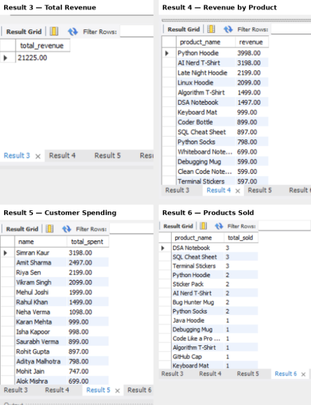

# Sahej Shop — SQL Data Analysis Project

## 📊 Project Overview

Sahej Shop is a SQL-based e-commerce data analysis project designed to explore customer behavior, product performance, orders, payments, and revenue.

The project demonstrates how SQL can be used to design a relational database, manage structured data, and generate meaningful business insights through analytical queries.

## 🗄️ Database Structure

The database consists of five related tables:

- `customers` — Customer information and signup details
- `products` — Product details, categories, prices, and stock
- `orders` — Customer orders and order status
- `order_items` — Products included in each order
- `payments` — Payment information and transaction amounts

The tables are connected using primary keys and foreign keys to maintain relationships between customers, orders, products, and payments.

## 🛠️ Tools & Skills

- MySQL
- SQL
- Database Design
- Primary & Foreign Keys
- Table Creation
- Data Insertion
- JOINs
- Aggregate Functions
- GROUP BY
- ORDER BY
- Filtering with WHERE
- Business Data Analysis

## 🔍 Analysis Performed

The project includes SQL queries to analyze:

1. **Total Revenue**
   - Calculates the overall revenue generated from payments.

2. **Revenue by Product**
   - Identifies products generating the highest revenue from delivered orders.

3. **Top Customers by Spending**
   - Determines customers who have spent the most.

4. **Products Sold**
   - Analyzes the quantity of each product sold.

5. **Cancelled Orders**
   - Calculates the total number of cancelled orders.

## 🧩 Entity Relationship Diagram

The database relationships are represented using an Entity Relationship Diagram (ERD).

## 📈 Query Results

The SQL analysis produces results for revenue, product performance, customer spending, product sales, and cancelled orders.

## 📁 Project Files

- `sahej-shop.sql` — Complete SQL database creation, data insertion, and analysis queries
- `er-diagram.png` — Database Entity Relationship Diagram
- `sql-query-results.png` — Screenshot of SQL query results

## 🎯 Key Learning Outcomes

This project demonstrates practical SQL skills including relational database design, handling relationships between multiple tables, writing analytical queries, and extracting business insights from structured data.

